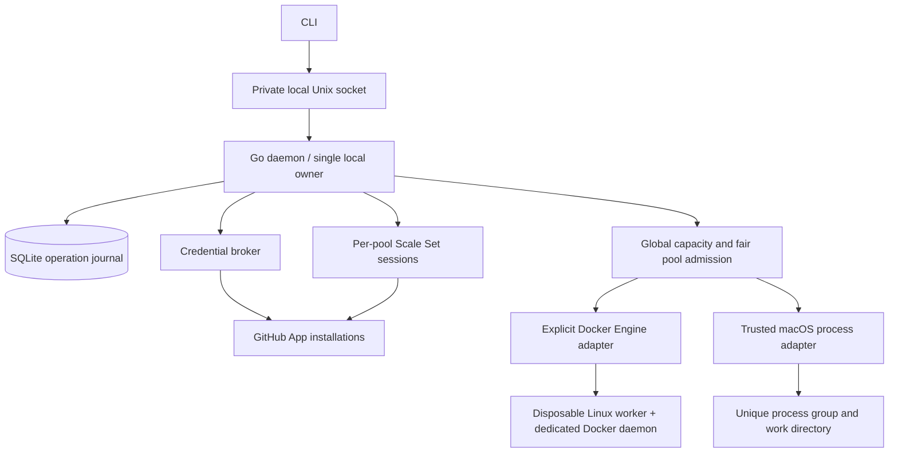

# Implementation plan

Planning baseline: 2026-09-07. Three independent reviews covered architecture/language, authentication/security, and TDD/delivery. Findings are summarized in this plan and the evidence ledger. No live product implementation has been validated.

## Problem and boundaries

Manual runner installations accept one job each. Adding capacity currently requires repeated registration and service setup. gh-runnerd should let an operator manage a desired number of Linux and macOS runners from one Mac CLI, independently for multiple GitHub organizations, while preserving a global resource budget.

The first host is an Apple Silicon Mac with 48 GiB RAM. An existing Linux VM has 6 vCPU, 12 GiB RAM and an 80 GiB disk ceiling. These are context for the pilot, **not** a claim that any particular number of test jobs is safe. Measure workloads before raising limits. Existing manual runners stay available until controlled pilot success.

### Required behavior

1. Manage all configured organizations and platforms through one daemon and CLI.
2. Offer fixed capacity and demand autoscaling with per-pool ceilings plus host/runtime budgets.
3. Use user-owned GitHub App installations and outbound GitHub connections only.
4. Preserve running jobs during ordinary scale-down, configuration changes and daemon upgrades.
5. Recover owned workers after manager crashes without duplicate creation or destructive global cleanup.
6. Publish evidence for reliability, trust limitations and performance; do not label a preview stable.
7. Keep workflow targeting at pool labels, never individual generated runner names.

### Explicit first-release limits

- One Mac host, macOS ARM64 manager. Linux integration tests may run elsewhere; a Linux-hosted manager is not promised initially.
- One-job Linux Docker workers with a worker-specific Docker daemon for service/container actions.
- Native macOS one-job processes for an explicit shared trust domain. OS packages, kernel, home-account access and ports are not strongly isolated.
- No macOS VM provider, GUI, cloud overflow, fleet controller, Windows provider or billing service in the first usable release.
- No automatic replay of interrupted workflows. A host reboot can fail a running job; show its outcome and leave rerun semantics to GitHub/the operator. Reconciliation is not job checkpointing.
- The manager will not install arbitrary runtime software or change global Docker contexts implicitly.

Those bullets describe the original product envelope. Maintainer-accepted delivery now sequences that envelope as R1 / R2 / R3 plus Future research; see [Approved delivery releases](#approved-delivery-releases). R1 does not delete these limits and does not reduce issue [#1](https://github.com/1XP-AI/gh-runnerd/issues/1)'s recovery Goal.

## Architecture

Use a native executable with `daemon` as an internal/explicit subcommand. CLI disconnect or terminal closure must not stop workers. Unix-socket permissions, peer identity and a single-owner lock protect control access; they do not isolate malicious code running as the same account. The protected native profile uses a controller identity distinct from job identities; its minimal helper and installation path are gated by G02/G11. SQLite stores configuration revisions, ownership IDs, desired/observed state, reservations and retry deadlines, **not** secret material.

Proposed package boundaries: `cmd/gh-runnerd`, `internal/config`, `internal/control`, `internal/store`, `internal/github`, `internal/auth`, `internal/scheduler`, `internal/worker/docker`, `internal/worker/native`, `internal/telemetry`. Freeze interfaces in issue G04 before parallel implementations touch them. Avoid a plug-in ABI in v0.1; use small typed interfaces inside one binary.

## State and scaling contract

Worker lifecycle: planned -> reserved -> creating -> ready -> busy -> draining -> exited -> cleanup -> removed, with explicit failed, unknown and quarantined outcomes. Actual transition validity is finalized in G05. Persist intent before external side effects; reconcile interrupted operations by stable manager/pool/worker identity. Marking a worker idle from a stale observation never authorizes deletion. Unknown jobs/workers retain reservations until evidence proves resources are gone; quarantine continues to hold those reservations.

Autoscale from GitHub's current assigned-job statistics, which include running jobs, rather than incrementing counts from individual messages. Publish a bounded maximum capacity per scale set and admit workers through one host-wide arbiter. GitHub assigns jobs; the local scheduler controls advertised capacity/provisioning, not a private replacement for GitHub's queue.

Fixed mode maintains a configured total number of ready/busy worker slots, replacing completed one-job workers. Autoscale mode uses minTotal/maxTotal with desired total = min(maxTotal, max(minTotal, TotalAssignedJobs)), then applies shared admission caps. CLI --min means minimum total, not minimum idle; idleBuffer is deferred. Reject contradictory limits. Scaling below current busy count changes future admission only. Fairness means preventing starvation of equally eligible pools as slots become available; it never preempts running jobs.

CPU/memory reservations must include Docker service daemons and services, creating workers, native macOS processes, and a reserve for the host. Native process mode cannot promise hard memory enforcement; react to pressure by stopping admission and surfacing diagnostics. Optional disk thresholds stop new workers before exhaustion. VM/container provider limits differ from host limits and must both be applied.

## Required evidence gates

- **G01, SDK contract:** compare a released SDK with audited source; decide a pinned version. The current high-level listener ACKs messages before application callbacks. A durable recovery design must pass crash/replay tests; using the listener does not by itself ensure durable processing.
- **G02, enrollment and credentials:** prove App Manifest loopback redirect and disabled-webhook behavior against real GitHub; OAuth loopback documentation is insufficient evidence. Test credential access under the actual launchd identity. Manual App import remains an explicit fallback if the automatic flow fails.
- **G10/G16, Linux compatibility:** an official-style worker image is minimal. Verify pinned runtime dependencies, checkout, service DB/Redis, job containers, network/mount paths and parallel cleanup using a private test repository. Never mount the manager's Docker socket or App credentials into jobs.
- **G11/G19, native trust:** demonstrate process/workdir cleanup and bound the guarantee. Keep untrusted/public-fork work out through runner-group and repository admission policy; do not infer trust from labels alone.
- **G17, reliability:** fault injection and a real soak are prerequisites for a release candidate. Record actual measurements and limitations.

## Delivery stages

M0 settles compatibility and contracts; M1 establishes durable control/authentication; M2 adds execution/scaling; M3 validates security and recovery; M4 packages and migrates through a canary; M5 contains optional VM/fleet research. Historical Stage/milestone values stay on the issues. **Release classification is authoritative for user-visible sequencing**; M0–M5 remain the capability taxonomy. A blocked gate still blocks dependent implementation of that issue's full original scope. Relabeling does not bypass native GitHub `blockedBy` edges.

Public PR checks run in GitHub-hosted standard environments without credentials. Trusted Mac hardware checks are explicit maintainer runs against reviewed commits. Building gh-runnerd must not depend on gh-runnerd already operating, or rollout failures would block its repair.

## Approved delivery releases

Issue [#66](https://github.com/1XP-AI/gh-runnerd/issues/66) records the maintainer-accepted split. Placement on a release means that release needs the **complete original scope**. It is not a claim that no safe subset is required earlier, and it is not permission to mark a parent Done. Where an original issue mixed internal-MVP and later acceptance, explicit children hold the R1 subset; parents stay open until their own criteria pass.

The live 36-item map is in [ISSUES.md](ISSUES.md). Production implementation of dependency-blocked full-scope issues is not authorized by this planning change.

### R1 — Internal MVP

Operator-visible exit: on this Mac, one organization, one private test repository, the existing reviewed Linux-container backend, concurrency one, and a manually configured App, run one owned job, clean up only owned resources, and demonstrate recovery or quarantine at ACK, acquisition and JIT boundaries.

Foreground only. `cmd/gh-runnerd` is still an empty entry point; unattended daemon, install, launchd service, reboot persistence, native macOS jobs, Lima or Docker-context changes, a second backend, multi-organization operation, automated Manifest enrollment and general scheduling are not R1 and are not implemented.

| Issue | R1 role versus original acceptance |
|---|---|
| [#1](https://github.com/1XP-AI/gh-runnerd/issues/1) G01 | **Full original Goal** remains: "Select and pin a supported Scale Set integration path with demonstrated recovery at message acknowledgement, acquisition and JIT boundaries." In progress. No false completion from child merges or a happy-path job. |
| [#67](https://github.com/1XP-AI/gh-runnerd/issues/67) | R1 subset of [#2](https://github.com/1XP-AI/gh-runnerd/issues/2): manual single-organization credentials. Ready; no live App/Keychain/launchd authorization. Parent #2 stays In progress on R3. |
| [#60](https://github.com/1XP-AI/gh-runnerd/issues/60) G01g | Bounded broker handoff for the paired Linux-container path. In progress in a separate worktree. |
| [#66](https://github.com/1XP-AI/gh-runnerd/issues/66) | Planning and documentation synchronization. |
| [#68](https://github.com/1XP-AI/gh-runnerd/issues/68) | R1 subset of [#13](https://github.com/1XP-AI/gh-runnerd/issues/13), coordinated slice of #4–#15: one foreground command, capacity one. Blocked by #60, #66 and #67. Freeze the minimal contract before implementation. Completing #68 does not complete #4–#15. |
| [#69](https://github.com/1XP-AI/gh-runnerd/issues/69) | R1 subset of [#16](https://github.com/1XP-AI/gh-runnerd/issues/16): authorized real private job plus required ACK/acquisition/JIT recovery. Blocked by #1 and #68. A passing happy-path job is not sufficient. |

Completed R1-placed records (#3, #30, #44, #46, #47, #50, #52, #54, #61, #64) are historical evidence slices. They do not close #1.

### R2 — Everyday operations

Practical install/start/stop/status, restart recovery, bounded scaling and repeated operational use. Full original acceptance of #4, #5, #6, #7, #9, #10, #12, #13, #14, #15, #20 and completed #40. Original G04 blockers (#1/#2/#3) and G13 blockers, including native-macOS #11, remain in force.

### R3 — General distribution

Multi-organization support, additional execution modes including trusted native macOS, automated onboarding, signing/update/diagnostics and broad qualification. Full original acceptance of #2, #8, #11, #16, #17, #18, #19. Completing #67 or #69 does not complete #2 or #16.

### Future research

[#21](https://github.com/1XP-AI/gh-runnerd/issues/21) G21 remains Future and is not a release dependency.

[#20](https://github.com/1XP-AI/gh-runnerd/issues/20) is placed on R2 for full original acceptance and remains natively blocked by R3 issues #17 and #18. That historical edge is preserved; this plan does not claim a dependency bypass.

After a single trusted canary workflow passes, expand to both organizations with separate pool labels. That expansion is G16/R3, not R1. Drain old workers after new capacity has proven itself. Keep a reversible configuration migration and the original services for rollback until the pilot exit criteria pass.

## Runner version freshness

The controller owns runner version policy. Pin verified downloads/image digests, monitor upstream supported-version/security requirements, and mark stale pools non-admitting rather than accepting work they cannot run. Refresh only future one-job workers; busy workers drain normally. An urgent required update can stop new admission, but never silently cancels running jobs. Define staged refresh and rollback in G04, implement per provider in G10/G11 and prove it under load in G17.
